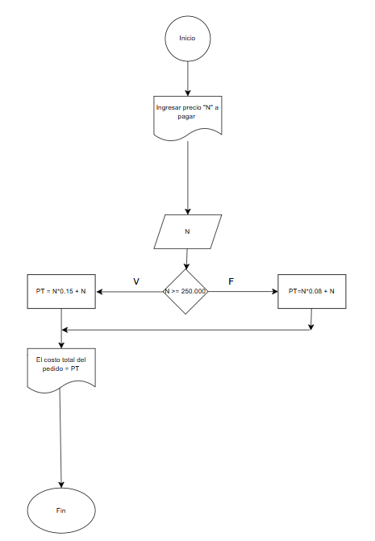

# Unidad No. 
## Información del estudiante  
Nombre del estudiante: Jacobo Durán Aristizábal
Id.: 000567698
---

# Tabla de Contenido

|Contenido|
|---------|
|[Ejercicio 1-Act2](#ejercicio-1-act2)|
|[Ejercicio 2-Act2](#ejercicio-2-act2)|
|[Tipos de Datos-Act2](#tamaño-en-bytes-de-los-tipos-de-datos)|
|[Conclusión-Act2](#conclusion-act2)|
|[Ejercicio 1-Act3](#ejercicio-1-act3)|
|[Ejercicio Final-Act3](#ejercicio-final-act3)|

## Ejercicio 1-Act2
### Representación de datos en una computadora
En la computadora se representan los datos mediante el sistema binario, que está hecho por combinaciones entre el 0 y el 1.  Muchas de las cosas se escribe o traduce en secuencias de bits. Los números se codifican utilizando el sistema binario. Y los caracteres con sistemas como el ASCII y las imagenes mediante matrices de píxeles con los valores numericos que indican su color.

### Conclusión Figura 2
Si está utilizando el sistema binario, los estados que puede tomar sería 2^n, ya que n son los bits que puedes combinar, donde cada bit solo puede tomar 2 valores, 1 o 0.

### Tabla de unidades de almacenamiento
| Unidad     | Símbolo | Equivalencia en Bytes                    |
|-----------|--------|------------------------------------------|
| Byte      | B      | 1 Byte                                   |
| KiloByte  | KB     | 10³ Bytes (1,024 Bytes en binario)      |
| MegaByte  | MB     | 10⁶ Bytes (1,048,576 Bytes en binario)  |
| GigaByte  | GB     | 10⁹ Bytes (1,073,741,824 Bytes en binario)  |
| TeraByte  | TB     | 10¹² Bytes (1,099,511,627,776 Bytes en binario) |
| PetaByte  | PB     | 10¹⁵ Bytes (1,125,899,906,842,624 Bytes en binario) |

### Importancia del trabajo de George Bool
George Bool hizo las bases del álgebra booleana, la cuál es utilizada en la computación moderna y lo que hace es a través de valores binarios se pueden representar operaciones, así facilitando la eletcroneca e informatica hoy en día. 

## Ejercicio 2-Act2

Unos números binarios convertidos a decimales 

- 1010101010_2: 1 * 2^9 + 0 * 2^8 + 1 * 2^7 + 0 * 2^6 + 1 * 2^5 + 0 * 2^4 + 1 * 2^3 + 0 * 2^2 + 1 * 2^1 + 0 * 2^0
- 11111_2: 1 * 2^4 + 1 * 2^3 +1 * 2^2 + 1 * 2^1 +1 * 2^0
- 10000000_2: 1 * 2^7 + 0 * 2^6 + 0 * 2^5 + 0 * 2^4 + 0 * 2^3 + 0 * 2^2 + 0 * 2^1 + 0 * 2^0
- 100100100_2: 1 * 2^8 + 0 * 2^7 + 0 * 2^6 + 1 * 2^5 + 0 * 2^4 + 0 * 2^3 + 1 * 2^2 + 0 * 2^1 + 0 * 2^0
- 111000_2: 1 * 2^4 + 1 * 2^3 + 1 * 2^2 + 0 * 2^1 + 0 * 2^0

Unos números decimales convertidos a binario

- 127_10: 1111111_2
- 246_10: 11110110_2
- 1025_10: 10000000001_2
- 354_10: 101100010_2
- 187_10: 10111011_2

## Tamaño en Bytes de los Tipos de Datos

| Tipo de dato     | C (bytes)             | Python (bytes)       | Java (bytes)        | JavaScript (bytes)  |
|-----------------|----------------------|----------------------|----------------------|----------------------|
| **Binario**     | Depende del tipo (`int`, `long`) | (`int`) | Depende del tipo (`int`, `long`) | 8 (`number`) |
| **Octal**       | Depende del tipo (`int`, `long`) | (`int`) | Depende del tipo (`int`, `long`) | 8 (`number`) |
| **Decimal**     | `int` (4), `float` (4), `double` (8) | `int`, `float` | `int` (4), `float` (4), `double` (8) | `number` (8) |
| **Hexadecimal** | `int` (4) | `int` | `int` (4) | `number` (8) |
| **Punto flotante** | `float` (4), `double` (8) | `float` | `float` (4), `double` (8) | `number` (8) |
| **Números grandes** | `long long int` (8) | `int` | `BigInteger` (variable) | `BigInt` (variable) |
| **Caracteres**  | `char` (1) | `str` | `char` (2) (Unicode) | `string` (variable) |
| **Cadenas**     | `char[]` (depende del tamaño) | `str`| `String` (variable) | `string` (variable) |
| **Booleanos**   | `_Bool` (1) | `bool`| `boolean` (1) | `boolean` (4) |
| **Arreglos**    | `int array[3]` (12) | `list`| `int[]` (12 + referencia) | `Array` (variable) |
| **Diccionarios** | No existe | `dict`| `Map<K, V>` (variable) | `Object` (variable) |
| **Estructuras** | `struct` (depende de los miembros) | `class` | `class` (variable) | `class` (variable) |

### Ejercicio de cálculo de espacio en memoria

19 bytes por registro
Por lo que en un día se guardan 8640 registros
Lo que múltiplicado por el tamaño de cada registro: 19 * 8640 = 164,160 bytes = 160,31 KB

## Conclusion-Act2 
Se puede concluir que la representación de datos en los computadores para poder almacenar y procesar información, lo que puede también llegar a influir en la eficiencia del programa. A través de este ejercicio aprendi como se representan los datos en la memoria y como la misma computadora logra asegurar su mejor rendimiento con estos sistemas tan eficientes y bien estructurados.

## Ejercicio 1-Act3

### Ejercicios

- Ejercicio 1

Psceudocodigo: 

        Inicio
            Escribir "Ingrese "N" cantidad de lapices"
            Leer N
    
             Si N >= 1000
                P = N * 85
             Si no
                P = N * 90
            Fin Si

            Escribir "El costo total del pedidio =" P
        Fin

- Diagrama de flujo:

- Ejercicio 2

Psceudocodigo: 

        Inicio

            Escribir "ingresar precio "N" a pagar"
            Leer N

            Si N >= 250.000
                PT = N * 0.15 + N
            Si no
                PT = N * 0.08 + N
            Fin Si

            Escribir "El costo total del pedido =" PT
        Fin

- Diagrama de flujo

- Ejercicio 3

Psceudocodigo:

        Inicio

            Escribir "Ingrese el número de alumnos "x""
            Leer x

            Si x >= 100
                C = 65
            Si no
                Si x < 50
                    C = 70
                Si no
                    Si x > 30
                        C = 95
                    Si no
                        T = 4000
            Fin Si

            Hacer t = x * C
            Escribir "El costo por alumno=" C "y el total a pagar ="T
        Fin

- Diagrama de flujo

## Ejercicio Final-Act3

### Parte 1
- Una pagina web no representa un algoritmo ya qué solo son un conjunto de elementos agrupados y no sigue un conjunto de pasos definidos u organizados de una forma especifica.
- Una receta para hacer un pastel, donde se indican los ingredientes y pasos a seguir si representa un algoritmo ya que tiene una secuencia de instrucciones para poder hacer el pastel.
- "Piensa un número y multiplicalo por otro" no es un algoritmo ya que determina de una manera especifica las variables y no tiene pasos de un resultado más alla de multiplicar un número por otro.
- un manual de instrucciones para armar un mueble, con pasos detallados y un orden claro si representa un algoritmo ya que se indican los pasos a seguir de una forma ordenada y detallada, los cuales son necesarios para poder llegar a armar el mueble.
- Una lista de compras organizada en orden alfabético no representa un algoritmo ya que solo son cosas agrupadas y no se esta ejecutan ningún proceso.

### Parte 2
- El valor de la gravedad en la Tierra, 9.8 m/s².  -> Puede ser considerada una constante a nivel superficial pero en realidad no lo es, ya que hay que tener en cuenta valores como altitud, lugar y otras cosas.
- La edad de una persona calculada en base al año actual y su año de nacimiento. -> Es variable, ya que la edad cambia.
- La cantidad de dinero en una cuenta bancaria. -> Es variable, ya que transacciones, intereses o impuestos puede hacerla cambiar de un momento a otro.
- La velocidad de la luz en el vacío, 299,792,458 m/s. -> Es una constante.
- El radio de un círculo. -> Es una variable, ya que el radio de cada circulo puede ser diferente.

### Parte 3

1. Para elegir la ruta más corta entre varias ciudades, el algoritmo examina rutas candidatas, deteniéndose cuando los cambios en la distancia parecen lo suficientemente pequeños. -> Si cumple con las caracteristicas de un algoritmo ya que se está siguiendo una secuencia de pasos para evaluar la mejor ruta posible en cuanto a distancia.

2. Suma los números ingresados y muestra el resultado. -> Si cumple con las caracteristicas de las variables, ya que se están dando una serie de instrucciones claras.

3. Un conjunto de pasos para calcular el área de un rectángulo dado su base y altura. -> Si cumple con las caracteristicas de un algoritmo, ya que describen los pasos para dar con un resultado en especifico.

4. El algoritmo cuenta el número de votos obtenidos por cada uno de los candidatos de una elección para presidente. Empieza solicitando el nombre del candidato y finaliza cuando se ingresa el valor -1. -> Si cumple con las caracteristicas de un algoritmo, ya que sigue una secuencia de pasos bien estructurados.

### Parte 4

- El pseudocódigo utiliza símbolos estándar para representar las operaciones lógicas. -> Falso
- Los diagramas de flujo son una representación gráfica de un algoritmo. -> Cierto
- El pseudocódigo debe estar escrito en un lenguaje de programación específico. -> Falso
- Un diagrama de flujo siempre debe tener un inicio y un fin claramente definidos. -> Cierto

### Parte 5

Las estructuras de control sirveb para definir como va a fluir la ejecución de un algoritmo. Un ejemplo de eso seria una decision básica como elejir entre dos platos en un restaurante. Si uno tiene verduras elejir el otros. Es por así decirlo un condicional. Un ejempko que se tengan que utilizar cálculos matemáticos seria para determinar si una nota es ganada o perdida. Si la nota >= 3, seria nota ganada.