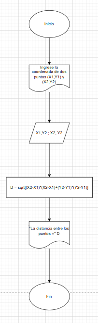
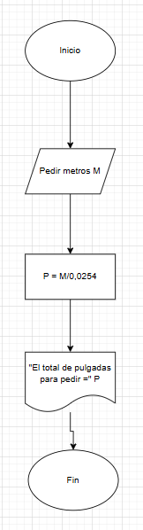
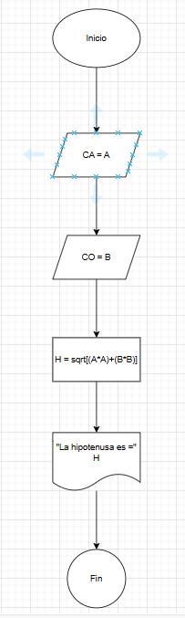

# Tabla de contenido
|Contenido|
|---------|
|[Reto1](#reto-1)|
|[Reto 2](#reto-2)|
|[Reto 3](#reto-3)|
|[Reto 4](#reto-4)|
|[Reto 5](#reto-5)|
|[Reto 6](#reto-6)|
|[Reto 7](#reto-7)|
|[Reto 8](#reto-8)|
|[Reto 9](#reto-9)|
|[Reto 10](#reto-10)|

## Reto 1
- Diagrama de flujo

- Psceudocodigo

        Inicio
            Escribir "Ingrese la coordenada de dos puntos (X1,Y1) y (X2,Y2)
            Leer X1,Y1
            Leer X2,Y2

            Hacer D = sqrt [(X2-X1)(X2-X1)+(Y2-Y1)(Y2-Y1)]

            Escribir "La distancia entre los puntos =" D
        Fin

## Reto 2
-Diagrama de flujo

- Psceudocodigo

        Inicio
            Escribir "Cantidad en metros (M)"
            Leer M
                P = M/0,0254
            Escribir "El total de pulgadas para pedir =" P
        Fin

## Reto 3
- Diagrama de flujo

- Psceudocodigo

        Inicio
            Escribir "Inserte cateto opuesto (CO) y cateto adyacente (CA)"
            Leer CO = B
            Leer CA = A

            Hacer H = sqrt [(A*A)+(B*B)]
            Imprimir "La hipotenusa es =" H
        Fin

## Reto 4
        Inicio
            Escribir "Ingrese la fecha de nacimiento (N), con fecha completa: dia, mes, año. También ingrese la fecha actual (H) en el mismo formato"
            Leer d_N, m_N, a_N
            Leer d_H, m_H, a_H
            Hacer E = a_N - a_H
            Leer E

                Si m_N < m_H
                    Escribir "Ya cumplio y la edad es" E
                Si no
                    Si m_N = m_H
                        Si d_N < d_H
                        Escribir "Ya cumpliste y la edad es" E
                        Si no
                            Si d_N = d_H
                            Escribir "Hoy estas cumpliendo años"
                            Si no
                            Hacer ER = E - 1
                            Escribir "No has cumplido años y tu edad es" ER
                    Si no
                    Hacer ER = E - 1
                    Escribir "No has cumplido y tu edad es" ER
                Fin Si
        Fin

## Reto 5

        Inicio
            Escribir "Ingrese la cantidad de horas trabajadas (HT) y cuanto le va a pagar por hora (PH)"
            Leer HT
            Leer PH

                Si HT <= 40
                    P = HT * PH
                    Escribir "El total a pagar a los trabajados es" P
                Si no
                    Si HT <= 45
                        P = (40 * PH) + [(HT - 40) * 2](PH)
                        Escribir "El total a pagar a los trabajadores es" P
                    Si no
                        Si HT <= 50 
                            P = (40 * PH) + [(HT - 40) * 2](PH) + [(HT - 45) * 3](PH)
                            Escribir "El total a pagar a los trabajadores es" P
                        Si no
                            Escribir "No es posible que un trabajador trabaje más de 50 horas"
                Fin Si
        Fin

## Reto 6

        Inicio
            Escribir "Ingrese N cantidades de números"
            Definir C1 = 0
            Definir C2 = 0
            Definir C3 = 0
            Leer N

            Para i desde 1 hasta N Hacer
                Escribir "Ingrese un número:"
                Leer A

                Si A > 0
                    C1 = C1 + 1
                Si no
                    Si A = 0
                        C2 = C2 + 1
                    Si no
                        C3 = C3 + 1
                Fin Si
            Fin Para

            Escribir "Los números mayores a 0 son:" C1
            Escribir "Los números iguales a 0 son:" C2
            Escribir "Los números menores a 0 son:" C3
        Fin

## Reto 7

        Inicio
            Definir ahorro_diario
            Definir ahorro_total
            Definir día

            ahorro_diario = 0,003
            ahorro_total = 0,00

            Para día desde 1 hasta 365 hacer
                Escribir "Día", día, ":Ahorro=", ahoroo_diario, "pesos"
                ahorro_total = ahorro_total + ahorro_diario
                ahorro_diario = ahorro_diario * 3
            Fin Para

            Escribir "El total ahorrado en un año es:", total_ahorro, "pesos"
        Fin

## Reto 8

        Inicio
            Escribir "Por favor ingrese la cantidad de articulos (N)"
            Leer N
            Definir total_pagar = 0
            
            Para i desde 1 hasta N Hacer
                Escribir "Ingrese el precio del articulo"
                Leer precio
                Si precio >= 200
                    PD = precio * 0,15
                Si no
                    Si precio > 100
                        PD = precio * 0,12
                    Si no
                        PD =precio * 0,1
                Fin Si
            
            precio_total = precio -PD
            total_pagar = total_pago + precio_total
            Escribir"Articulo", i, ":Precio=", precio, "Descuento=", PD, "Precio Final=", precio_total
            Fin Para

            Escribir "El total por pagar por los", N, "articulos es", total_pagar, "pesos"
        Fin

## Reto 9

        Inicio
            Escribir "Ingrese el valor de x"
            Leer x
            Escribir "Ingrese la cantidad (N) de términos que desea imprimir"
            Leer N
            
            e^x = 1
            término =1
            i=1

            Mientras i < N Hacer
                término = término * x/ i
                e^x = e^x + término
                i = i + 1
            Fin Mientras

            Escribir "El valor aproximado de e^x es:" e^x
        FIn

## Reto 10

        Inicio
            Escribir "ingrese el valor de x en radianes"
            Leer x
            Escribir "Ingrese el número de términos (N) que desea imprimir"
            Leer N

            Sen(x) = x
            término =x
            i = 1

            Mientras i < N Hacer
                término = término * (-1) * x * x/ [(2 * i) * (2 * i + 1)]
                Sen(x) = Sen(x) + término
                i = i + 1
            Fin Mientras

            Escribir "El valor aproximado de Sen(x) es:", Sen(x)
        Fin 